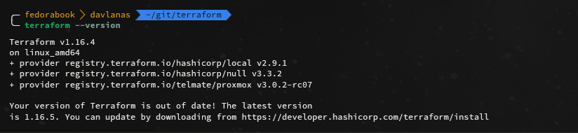
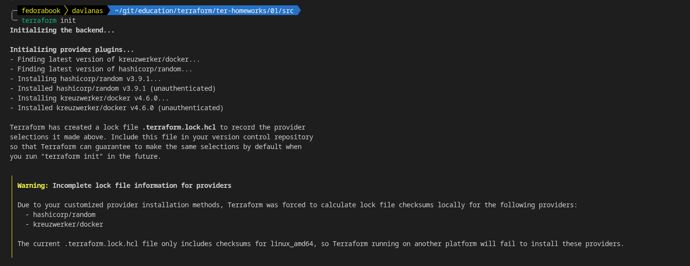
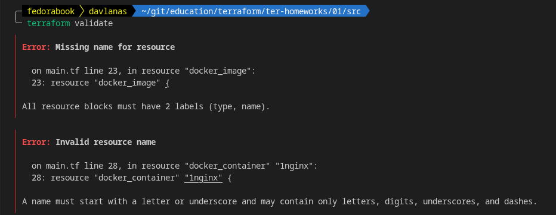
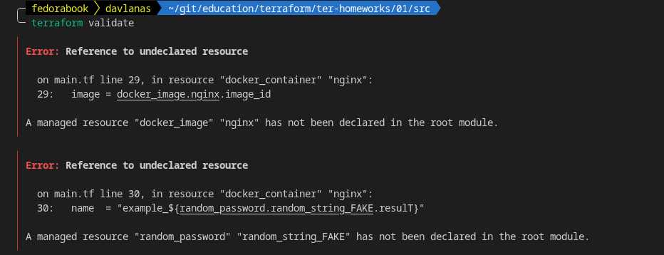

### Домашнее задание по первому модулю terraform.
## Чек-лист


## Задача №1

1. 


2. **personal.auto.tfvars** - В этом файле хранятся персональные секреты.

3. 
```
cat terraform.tfstate | grep result
            "result": "nED56d6s1D9iOQ2W",
                "value": "result"
  "check_results": null
```
4. 




**Первая ошибка** вызвана тем, что не задано имя ресурса, только его тип. \
**Вторая ошибка** связана с тем, что label может начинаться только с буквы или подвала. \
**Третья ошибка** связана с тем, что не существует ресурса с именем **random_string_FAKE** присутствует только **random_string**. \
**Четвертая ошибка** в строке 
```
name  = "example_${random_password.random_string.resulT}"
```
Т.к в **result** последняя буква заглавная, чего быть не должно, т.к terraform чувствителен к регистру.

5. 
Исправленный фрагмент **main.tf**
```
resource "docker_image" "nginx" {
  name         = "nginx:latest"
  keep_locally = true
}

resource "docker_container" "nginx" {
  image = docker_image.nginx.image_id
  name  = "hello_world"

  ports {
    internal = 80
    external = 9090
  }
}
```

Вывод команды **docker ps**
```
docker ps
CONTAINER ID   IMAGE          COMMAND                  CREATED         STATUS         PORTS                  NAMES
0137614a4911   57df7715e516   "/docker-entrypoint.…"   6 seconds ago   Up 5 seconds   0.0.0.0:9090->80/tcp   example_nED56d6s1D9iOQ2W
```
6. Ключ **-auto-approve** опасен тем, что сходу применяет изменения. Если при редактировании конфигурации случайно были удалены лишние ресурсы, то при вводе **terrafor apply -auto-approve** все изменения применятся сразу. Лучше всего его не использовать, а лишний раз убедиться в том, что план верный и только потом набрать **yes**. \
Использовать данный ключ будет удобно при автоматизации, т.к автоматика не будет и не может перепроверить план, а следовательно не может она осмысленно ответить и на вопрос, который задает terraform. \
Так же ключ можно использовать в тестовых средах, где совершенно не важно упадет ли какой-то сервис. Можно еще использовать при применении заранее проверенного плана.
```
╭─ fedorabook  davlanas  ~/git/education/terraform/ter-homeworks/01/src                                                                                                                                                                                                                                                                               ✔   main ●  78% (0:55) 🔋  16:13:42 
╰─ docker ps                    
CONTAINER ID   IMAGE          COMMAND                  CREATED         STATUS         PORTS                  NAMES
c9f8a5397471   57df7715e516   "/docker-entrypoint.…"   3 seconds ago   Up 2 seconds   0.0.0.0:9090->80/tcp   hello_world
```
7. 
```
╭─ fedorabook  davlanas  ~/git/education/terraform/ter-homeworks/01/src                                                                                              ✔   main ●  79% 🔋  16:23:05 
╰─ cat terraform.tfstate 
{
  "version": 4,
  "terraform_version": "1.16.4",
  "serial": 11,
  "lineage": "600c3069-a7df-5aa8-a297-9af0ed4a3fac",
  "outputs": {},
  "resources": [],
  "check_results": null
}
```
8. Docker image не был удален, т.к в блоке docker_image используется аргумент **keep_localy**.

> keep_locally (Boolean) If true, then the Docker image won't be deleted on destroy operation. If this is false, it will delete the image from the docker local storage on destroy operation.
